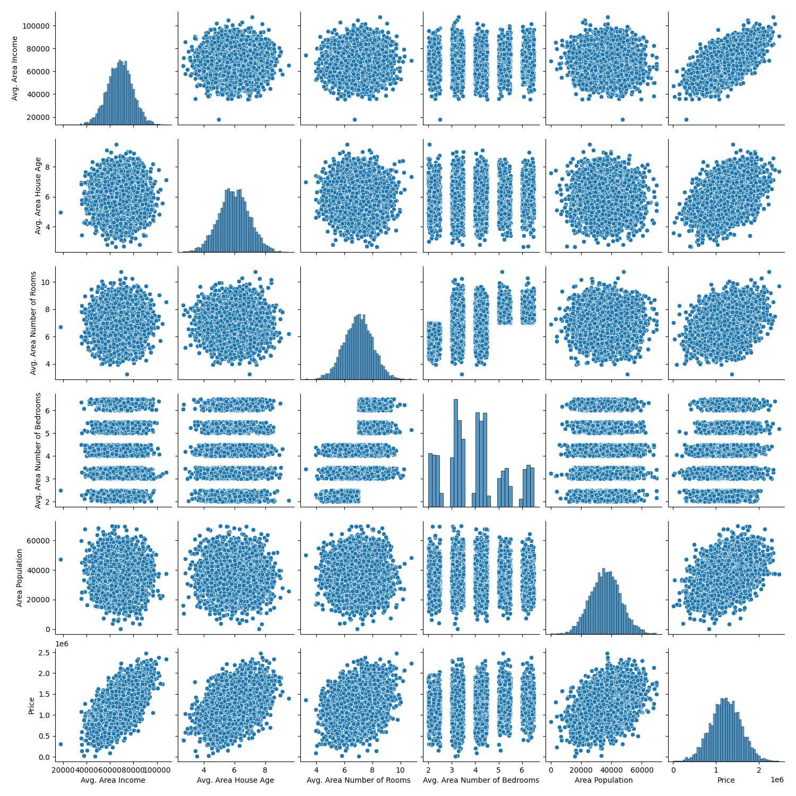

# House Price Prediction

A regression project that predicts house prices from neighbourhood
characteristics using **Linear Regression**. It trains on the `USA_Housing`
dataset - 5,000 rows of area-level features - and explains about **92% of the
variance** in price (R-squared = 0.92) on the held-out test set.

The full workflow lives in a single notebook, [`Jupyter.ipynb`](Jupyter.ipynb):
load the data, explore how the features relate to price, scale them, fit a
linear model, and check its accuracy and coefficients.

## The dataset

Each row describes the average characteristics of the area a house sits in,
plus its price. The `Address` column is text and is dropped before modelling.

| Feature                        | What it measures                          |
|--------------------------------|-------------------------------------------|
| Avg. Area Income               | Average income of residents in the area   |
| Avg. Area House Age            | Average age of houses in the area         |
| Avg. Area Number of Rooms      | Average room count                        |
| Avg. Area Number of Bedrooms   | Average bedroom count                     |
| Area Population                | Population of the area                    |
| **Price**                      | Target - the house price                  |

The data is synthetic (a common teaching dataset), so the relationships are
clean and well suited to a first regression model.

## Exploratory analysis

The notebook draws a Seaborn **pairplot** - every feature plotted against every
other, with histograms down the diagonal:



The most useful row is the bottom one, **Price** against each feature. **Avg.
Area Income** shows the clearest straight-line relationship with price - richer
areas mean pricier houses - while house age, room count, and population show
weaker but still positive trends. Bedroom count is discrete (2 to 6), so its
columns look banded rather than a smooth cloud. These are exactly the linear
relationships a linear model is built to capture.

## Approach

1. **Drop non-numeric columns.** `Price` (the target) and `Address` (free text)
   are removed from the feature set.
2. **Scale the features** with `StandardScaler`, so every feature is on the same
   footing and the coefficients are comparable.
3. **Split** 70% train / 30% test.
4. **Fit** a `LinearRegression` model.
5. **Evaluate** with the R-squared score, and inspect the learned coefficients.

## Results

The model reaches an **R-squared of about 0.92** on the test set - it explains 92% of
the variation in house prices.

Ranking the (scaled) coefficients shows which features drive the prediction:

| Feature                      | Coefficient  |
|------------------------------|--------------|
| Avg. Area Income             | ~230,000     |
| Avg. Area House Age          | ~164,000     |
| Area Population              | ~151,000     |
| Avg. Area Number of Rooms    | ~122,000     |
| Avg. Area Number of Bedrooms | ~1,600       |

Area income is the strongest predictor, and bedroom count barely moves the
price at all once the other features are known.

## Tech stack

| Tool                 | Role                                        |
|----------------------|---------------------------------------------|
| pandas / numpy       | Data loading and manipulation               |
| seaborn / matplotlib | Exploratory plots                           |
| scikit-learn         | Scaling, train/test split, Linear Regression |
| Jupyter              | Notebook environment                        |

## Getting started

### 1. Clone

```bash
git clone https://github.com/DharamVeer970/House_Price_Prediction.git
cd House_Price_Prediction
```

### 2. Install dependencies

```bash
pip install -r requirements.txt
```

### 3. Run the notebook

```bash
jupyter notebook Jupyter.ipynb
```

Run the cells top to bottom, or execute it headlessly:

```bash
jupyter nbconvert --to notebook --execute Jupyter.ipynb
```

## Project structure

```
House_Price_Prediction/
|-- Jupyter.ipynb           # The full analysis and model
|-- USA_Housing.csv         # Dataset (5,000 rows)
|-- output.jpg             # Feature pairplot
|-- requirements.txt        # Python dependencies
`-- README.md
```

## Possible improvements

- Report additional error metrics (MAE, RMSE) alongside R-squared for an intuition of
  the dollar-scale error.
- Plot predicted vs actual prices and the residual distribution (the notebook
  already sketches these) to check the linear assumptions hold.
- Try regularised models (Ridge, Lasso) and compare.
